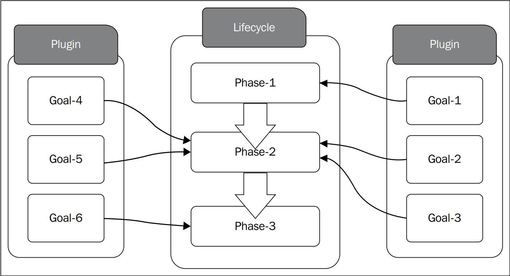

# Chapter 4. Build Lifecycles

The following figure shows the relationship between maven plugin goals and lifecycle phases:




* <font color='red'>**[重要觀念] phaese name 必須是唯一個，因為 maven 是藉由 phases name 間接找到 lifecycle**</font>

* <font color='red'>**[重要觀念] Goals 可以自己獨自執行，但也可以登記到特定的phase**</font>


> $ mvn clean install
>
> clean & install 都是指 phase name

> $ mvn clean:clean
>
> first clean 是指 plugin，second clean 是指 goal


## Standard Lifecycles in Maven

* Maven comes with three standard lifecycles : 
    1. default : handles your <font color='red'>**project deployment**</font>
    2. clean : handles <font color='red'>**project cleaning**</font>
    3. site : handles <font color='red'>**the creation of your project's site documentation**</font>


### The clean lifecycles

* The clean lifecycles defines three phases, execution order as follow:

  1. pre-clean
  2. clean
  3. post-clean

  

* By default

  1. the <font color='red'>**clean goal**</font> of the clean plugin is bundled the <font color='red'>**clean phase**</font> of the clean lifecycle，設定在 super POM 
  2. <font color='red'>pre-clean</font> phase and <font color='red'>post-clean</font> don't have any plugin binding.


* goal-phase mapping code snippet

```xml
<plugin>
	<artifactId>maven-clean-plugin</artifactId>
    <version>...</version>
    <executions>
    	<execution>
        	<id>...</id>
            <phase>clean</phase>
            <goals>
            	<goal>clean</goal>
            </goals>
        </execution>
    </executions>
</plugin>
```


<font color='red'>**[重要觀念] phases不做任何動作，綁定在phases上的goals才是真正執行動作的**</font>


### The default lifecycles

* The default lifecycle in Maven defines 23 phases, execution order as follow

  1. <font color='blue'>**validate**</font> : validate POM file and necessary information is available
  2. <font color='blue'>**initialize**</font> : 藉由配置正確目錄結構和初始化properties來初始化建構
  3. <font color='blue'>**generate-sources**</font> : generates any required source code
  4. <font color='blue'>**process-sources**</font> : processes the generated source code
  5. <font color='blue'>**generate-resources**</font> : generate any resources that need to be packaged with the final artifact
  6. <font color='blue'>**process-resources**</font> : processes the generated resources，複製到特定目錄並準備被打包
  7. <font color='blue'>**compile**</font> : compiles the source code
  8. <font color='blue'>**process-classes**</font> : can be used to carry out any bytecode enhancements after the compile phase
  9. <font color='blue'>**generate-test-sources**</font> : generates any required source code for test
  10. <font color='blue'>**process-test-sources**</font> : processes the generated source test code
  11. <font color='blue'>**generate-test-resources**</font> : generates all the resources required to run test 
  12. <font color='blue'>**process-test-resources**</font> : processes the generated test resources，複製到特定目錄並準備進行測試
  13. <font color='blue'>**test-compile**</font> : compiles the source code for test
  14. <font color='blue'>**process-test-classes**</font> : can be used to carry out any bytecode enhancements after the test-compile phase
  15. <font color='blue'>**test**</font> : 使用適當的unit test framework執行測試
  16. <font color='blue'>**prepare-package**</font> : 整理要打包的artifacts
  17. <font color='blue'>**package**</font> : 將artifacts打包成發佈格式，如jar、war
  18. <font color='blue'>**pre-integration-test**</font> : performs any required action before runnning integration tests
  19. <font color='blue'>**integration-test**</font> : runs integration tests
  20. <font color='blue'>**post-integration-test**</font> : be used to performs any cleanup tasks after running the integration tests
  21. <font color='blue'>**verify**</font> : 驗證package的有效性(validity)。檢查有效性的規則必須藉由respective plugins定義
  22. <font color='blue'>**install**</font> : installs the final artifact in the local repository 
  23. <font color='blue'>**deploy**</font> : deploys the final artifact to a remote reository


* The phases in the default lifecycle do not have any associated plugin goals

* The plugin bindings for each phase are defined by the <font color='red'>**corresponding \<packaging\>**</font>


> $ mvn help:describe -Dcmd=deploy
>
> deploy是指phase。查詢執行 mvn deploy 時的 phase-goals mapping。


### The site lifecycle

* The site lifecycle has four phases:
    1. pre-site
    2. site
    3. post-site
    4. site-deploy
    
* The site plugin is used to generate static HTML content for a project. The generated HTML content will also include appropriate reports corresponding to the project    


## Lifecycle bindings

* The standard Maven lifecycles and their associated bindings are defined under the file <font color='red'>**META-INF/plexus/components.xml of MAVEN_HOME/lib/maven-core-3.6.3.jar**</font>
* components.xml : <font color='red'>**component descriptor**</font>，描述project lifecycle


* the default lifecycle的配置

```xml
<!-- Lifecycle component -->
<component>
    <!-- Java interface -->
	<role>org.apache.maven.lifecycle.Lifecycle</role>
    
    <!-- Implementation -->
    <implementation>org.apache.maven.lifecycle.Lifecycle</implementation>
    
    <!-- Component identity = <role> + <role-hint> -->
    <!-- Lifecycle name -->
    <role-hint>default</role-hint>
  	
    <configuration>
        <id>default</id>
        
        <!-- 這裡的順序就是執行順序 -->
        <phases>
        	<phase>validate</phase>
        	<phase>initialize</phase>
        	<phase>generate-sources</phase>
        	<phase>process-sources</phase>
        	<phase>generate-resources</phase>
        	<phase>process-resources</phase>
        	<phase>compile</phase>
        	<phase>process-classes</phase>
        	<phase>generate-test-sources</phase>
        	<phase>process-test-sources</phase>
        	<phase>generate-test-resources</phase>
            <phase>process-test-resources</phase>
        	<phase>test-compile</phase>
        	<phase>process-test-classes</phase>
        	<phase>test</phase>
        	<phase>prepare-package</phase>
        	<phase>package</phase>
        	<phase>pre-integration-test</phase>
        	<phase>integration-test</phase>
        	<phase>post-integration-test</phase>
        	<phase>verify</phase>
        	<phase>install</phase>
            <phase>deploy</phase>
        </phases>
    </configuration>
</component>
```


* the clean lifecycle的配置

   ```xml
<component>
	<role>org.apache.maven.lifecycle.Lifecycle</role>
	
    <implementation>org.apache.maven.lifecycle.Lifecycle</implementation>
	
    <role-hint>clean</role-hint>
	
    <configuration>
    	<id>clean</id>
        
        <phases>
        	<phase>pre-clean</phase>
            <phase>clean</phase>
            <phase>post-clean</phase>
        </phases>
        
        <default-phases>
        	<clean>
            	org.apache.maven.plugins:maven-clean-plugin:2.4.1:clean
            </clean>
        </default-phases>
    </configuration>
</component>
   ```


* the site lifecycle的配置

```xml
<component>
	<role>org.apache.maven.lifecycle.Lifecycle</role>
    <implementaion>org.apache.maven.lifecycle.Lifecycle</implementaion>
    <role-hint>site</role-hint>
    <configuration>
    	<id>site</id>
        
        <phases>
        	<phase>pre-site</phase>
            <phase>site</phase>
            <phase>post-site</phase>
            <phase>site-deploy</phase>
        </phases>
        
        <default-phases>
        	<site>
            	org.apache.maven.plugins:maven-site-plugin:2.0.1:site
            </site>
            	org.apache.maven.plugins:maven-site-plugin:2.0.1:deploy
            <site-deploy>
            	
            </site-deploy>
        </default-phases>
    </configuration>
</component>
```


* 將 goals 結合到現存的 lifecycle

```xml
<component>
	<role>org.apache.maven.lifecycle.mapping.LifecycleMapping</role>
	<implementation>org.apache.maven.lifecycle.mapping.DefaultLifecycleMapping</implementation>
	<role-hint>jar</role-hint>
    
    <configuration>
    	<lifecycles>
        	<lifecycle>
                <!-- 對 default lifecycle 進行goal mapping -->
            	<id>default</id>
                
                <phases>
                	<process-resources>
                        org.apache.maven.plugins:maven-resources-plugin:2.4.3:resources
                    </process-resources>
                    <compile>
                        org.apache.maven.plugins:maven-compiler-plugin:2.3.2:compile
                    </compile>
                    <process-test-resources>
                    	org.apache.maven.plugins:maven-resources-plugin:2.4.3:testResources
                    </process-test-resources>
                    <test-compile>
                    	org.apache.maven.plugins:maven-compiler-plugin:2.3.2:testCompile
                    </test-compile>
                    <test>
                    	org.apache.maven.plugins:maven-surefire-plugin:2.5:test
                    </test>
                    <package>
                    	org.apache.maven.plugins:maven-jar-plugin:2.3.1:jar
                    </package>
                    <install>
                    	org.apache.maven.plugins:maven-install-plugin:2.3.1:install
                    </install>
                    <deploy>
                    	org.apache.maven.plugins:maven-deploy-plugin:2.5:deploy
                    </deploy>
                </phases>
            </lifecycle>
        </lifecycles>
    </configuration>
</component>
```


## Building custom lifecycles

* custom lifecycle有2種方式
    1. 對已存在的lifecycle，增加新的goals to phases mapping
    2. 定義全新的lifecycle
    
> The Maven architecture is based on the Inversion of Control(IoC) architectural principal
>
> Maven uses Plexus as its IoC container. 
>
> Plexus is similar to other IoC container or dependency injection framework such as Spring.
>
> The com
>
> ensions
